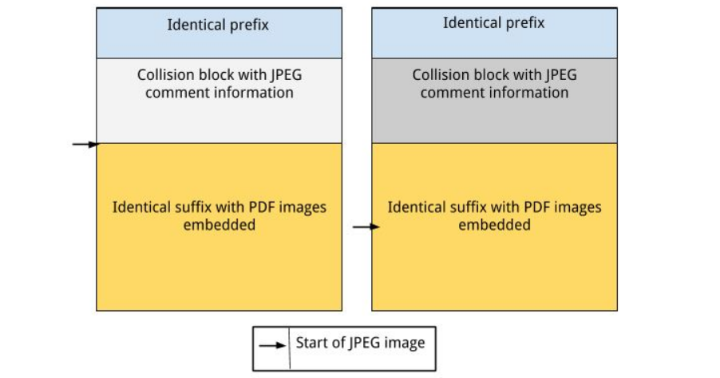

Instituto Superior Técnico, Universidade de Lisboa

**Network and Computer Security**

# Lab guide:
## Goals
The goal of this repository is to learn how to execute a collision attack on hash algorithm sha-1. You will learn how to use an Open-Source Python function on your local machine to perform the attack. We will use the function of the following public repository: 
https://github.com/nneonneo/sha1collider.

## Introduction
The Secure Hash Algorithm 1 (SHA-1) was released in 1995 by NIST, and since then it has been used to check the integrity of data. This hash function, SHA-1 takes an arbitrary size input and generate a fixed-size value of 160 bits. As every hash function, SHA-1 have some common properties, it must generate very different output values for similar inputs, 
the function is an one-way function, which means that given an output, it must be impossible to get the respective input, and the function has to be resistant to collisions, it must be computationally infeasible to find two inputs that give the same output. 
Since 2005, due to cryptanalysis, different attack reports on SHA-1 have been released by different entities, announcing improvements to different kind of attacks to this algorithm, like brute-force attacks.
In 2017, the CWI (Centrum Wiskund & Informatica) and Google announced an attack where they generated two different PDF files with the same SHA-1 hash, which is the attack we are studying here.

The attack performed was an identical-prefix collision attack. We have a given prefix P that is extended with two distinct near-collision block pairs that are very similar such that they collide by adding a collision block that adjust those differences. Then when the collision is done, any suffix S can be added and the collision will not be affected.


You can find the prefix and the two near-collision block pairs and how were they chosen and calculated in this article: https://shattered.io/static/shattered.pdf

This attacks benefits from the structure of the jpeg images in pdf files.

The prefix is identical but the secret behind this attack is when the jpeg images would initialize there will be a jpeg header that will define the jpeg comment length where that collision block would be added defining the start and end points of the comments fields for each file. This meant that while both files have the "data" for both PDFs embedded in their files, each renders a different image, depending on which image their JPEG comment length hides, as shown in Figure 1 below.
For the first pdf the comment length was 0x173 and the second comment length was 0x17f so a visual desynchronization was created by the comments having different length so in the second case the first bytes will be ignored because they are commented. Although the pdf data include both images renderization by commenting one there will be only one that will be displayed that will be the second one.

In conclusion, the pdfs will display different images despite of having both images in the two different pdf data files.




## Setup
Before starting this assignment you will need a few steps to be able to execute the attack:

- At first you will need to install python:

```bash
$ sudo apt-get install python3
```

- Then you will need to clone this repository into your workspace

```bash
$ git clone https://github.com/tecnico-sec/Fake-Signature-Attack.git
```
or via SSH

```bash
$ git clone git@github.com:tecnico-sec/Fake-Signature-Attack.git
```

- You need to install the library Pillow.

```bash
$ pip install Pillow
```

- You need to install ghostscript:
```bash
$ sudo apt-get update
$ sudo apt-get -y install ghostscript
```

- Then install cjpeg:
```bash
$ sudo apt-get update
$ sudo apt-get -y install cjpeg:
```

You are now able to execute the attack:

Calculate the Sha1 hash code for both files in the directory:
 ```bash
$ sha1sum eve.pdf
$ sha1sum eve1B.pdf
```

Compare the two hashes.

<!-- They are different -->

Execute the following command:
```bash
$ python3 collide.py eve.pdf eve1B.pdf
``` 

Note that two new pdfs were generated, out-eve.pdf and out-eve1B.pdf.

If some output file is corrupted, in other words, the output file that is associated to the files in the directory is different in comparison to that file (ex: out-eve.pdf needs to be equal to eve.pdf) try the following command:
```bash
$ python3 collide.py eve.pdf eve1B.pdf --progressive
``` 

Calculate the Sha1 hash code for both output files.

```bash
$ sha1sum out-eve.pdf
$ sha1sum out-eve1B.pdf
```

Compare the two hashes.

<!-- They are the same -->

**Acknowledgments**
...
----

[SIRS Faculty](mailto:meic-sirs@disciplinas.tecnico.ulisboa.pt)
